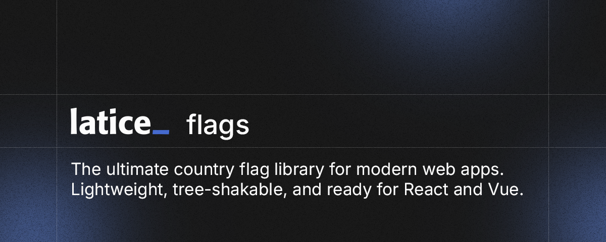

<br />

Country flag components for React and Vue. Lightweight, tree-shakable, SSR-ready.

## Packages

|                                                                                                    | Package               | Version                                                                                                                                      | Downloads                                                                                                                                           | Source                             |
| -------------------------------------------------------------------------------------------------- | --------------------- | -------------------------------------------------------------------------------------------------------------------------------------------- | --------------------------------------------------------------------------------------------------------------------------------------------------- | ---------------------------------- |
|  | `@latice/flags-react` | [](https://www.npmjs.com/package/@latice/flags-react) | [](https://www.npmjs.com/package/@latice/flags-react) | [packages/react](./packages/react) |
|    | `@latice/flags-vue`   | [](https://www.npmjs.com/package/@latice/flags-vue)     | [](https://www.npmjs.com/package/@latice/flags-vue)     | [packages/vue](./packages/vue)     |

> A React Native package is in development.

## Monorepo structure

```
packages/
├── core/      # shared types, constants, SVG sources (private)
├── react/     # @latice/flags-react
└── vue/       # @latice/flags-vue
```

## Development

```bash
pnpm install
pnpm build     # build all packages
pnpm gen       # regenerate flag components from SVGs
pnpm format    # format code with Prettier
pnpm typecheck
```

## License

[ISC](./LICENSE)
